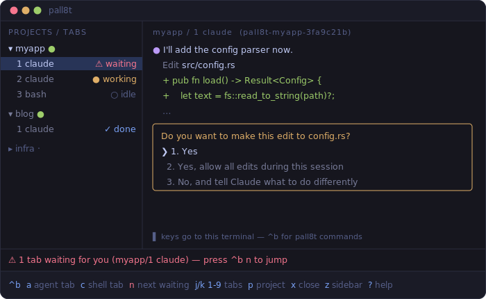

# pall8t

*(pronounced "pallet" — the thing containers ship on)*

Run AI coding agents inside [apple/container](https://github.com/apple/container) sandboxes, several at once, and always know which one needs you. pall8t is a minimal agent multiplexer TUI (Rust + ratatui): each tab is a real PTY exec'd into a per-project container; the sidebar shows every agent's state — working, **waiting for your approval**, idle, done.



## Why

- **One agent session per task, in parallel.** Tabs are independent `container exec` sessions; sessions never mix.
- **Sandboxed by construction.** Agents run in a lightweight VM, never on the host. Files land as *your* UID, never root. Host credentials never enter the container.
- **Multi-repo projects.** A project references several repos; agents cut git worktrees in a host-persistent workspace that survives container restarts (mounted at the identical path inside the container).
- **Runs anywhere a terminal runs** — standalone or inside an IDE's integrated terminal (VS Code etc.).
- **Agent awareness, herdr-style.** Waiting-for-approval detection with bell/banner notification and one-key jump (`^b n`).
- **Sessions survive the TUI.** Each tab lives in a tiny detached `pall8t-tab` holder process: quit pall8t (or close the IDE window) and agents keep running; relaunching reattaches. Multiple pall8t instances share one source of truth (ADR-0005).

Replaces a Podman + DevContainer stack on macOS without pretending to be docker (see `docs/adr/`).

## Requirements

- macOS on Apple silicon, [apple/container](https://github.com/apple/container) installed and started (`container system start`)
- git, Rust toolchain (build from source for now)

## Install & run

```sh
cargo install --path .
pall8t .        # add the current repo as a project, seed its workspace, open an agent tab
```

## Keys

Press the prefix (`ctrl+b` by default), release, then:

| Key | Action |
| :---- | :---- |
| `a` / `c` | New agent tab / shell tab in the current project |
| `n` | Jump to the next tab **waiting for you** |
| `j` / `k`, `1`–`9` | Cycle tabs / jump to tab N |
| `p` / `P` | Cycle project / add project (comma-separated repo paths) |
| `x` | Close tab, killing the agent inside (stops the container when it was the project's last tab, across all instances) |
| `s` / `b` / `L` | Start-stop container / rebuild image / logs |
| `z` | Toggle sidebar |
| `?` | Help |
| `q` | Detach: quit the TUI, agents and containers keep running; relaunch `pall8t` to reattach |

All other keys go straight to the active tab's terminal.

## Config

`~/.config/pall8t/config.toml` — see [docs/design/DESIGN.md](docs/design/DESIGN.md) for the full design and [docs/adr/](docs/adr/) for architecture decisions.

If a repo contains `.pall8t/Containerfile`, pall8t builds that project's image from it automatically (this repo ships one with a Rust toolchain, so agents can develop pall8t inside pall8t). Toolchains in custom Containerfiles must live outside `/home/dev` — the persistent home mount shadows it.
