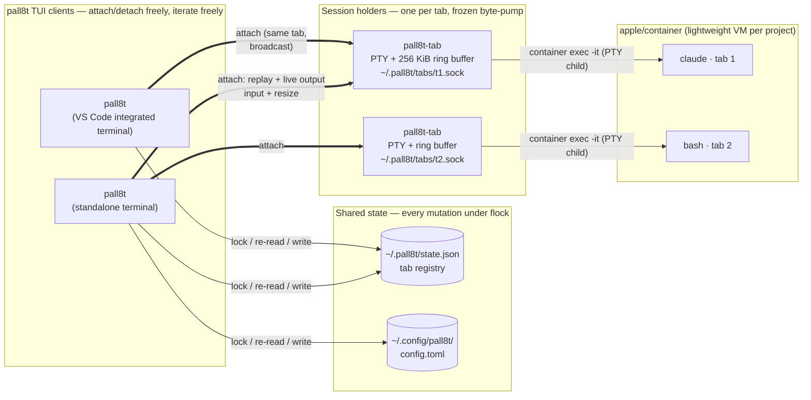

# ADR-0005: Per-tab session holders instead of a central daemon

- Status: Accepted
- Date: 2026-07-05
- Prompted by: [#2 Server/client architecture: central state daemon + detach/reattach](https://github.com/TakiTake/pall8t/issues/2)
- Amends: ADR-0003 (its "detach is out of scope" consequence is withdrawn)

## Context

State currently lives inside a single foreground TUI process. Three failure modes:

- **P1 — config clobbering.** Each pall8t instance loads `config.toml` at startup and writes the whole file on mutation: last write wins, no locking.
- **P2 — no detach/reattach.** TUI exit kills every `container exec` PTY and the agents inside. Closing an IDE window kills your agents. This was an accepted non-goal; the usage that matters (IDE integrated terminals) makes it unacceptable.
- **P3 — container lifecycle races.** Two instances sharing a project don't know about each other's tabs: instance A closing its last tab auto-stops the container out from under instance B's live sessions. Recreate-on-image-change has the same blindness.

Root cause for all three: no shared source of truth across processes.

## Options considered

**A. Central daemon (tmux/herdr model, as proposed in #2).** One `pall8t-server` owns config, PTYs, vt100 state, container reconciliation; TUIs are thin clients over one socket.
*Pros:* solves P1–P3 completely; proven shape; detached-state notifications possible; natural home for a future socket API.
*Cons:* the daemon is a single point of failure — one bug kills **every** agent session, and this codebase is young and iterating fast; upgrading the daemon binary kills all sessions (tmux has this exact problem); needs a control-plane RPC protocol, multiplexed screen streaming, daemon lifecycle (autostart, stale-socket detection), and client/daemon version-skew handling. Most of that machinery exists to serve *one* essential capability we lack: keeping PTYs alive.

**B. Status quo + file locking.** flock around config read-modify-write, mtime-based reload.
*Pros:* tiny. *Cons:* fixes P1 only; P2/P3 remain.

**C. Single-instance lock.** Second launch refuses to start.
*Pros:* trivial, eliminates races. *Cons:* kills the multi-entry-point usage (IDE terminal + standalone) that is a stated sales point; P2 remains.

**D. Per-tab session holders + lock-protected registry (chosen).** Split tmux's idea into its two halves and take only the half we need. A **holder** is a tiny detached process (`pall8t-tab`) that owns one PTY: it spawns the `container exec` child, keeps a raw-output ring buffer, and serves a per-tab Unix socket (replay + broadcast out, input/resize in) — dtach/abduco's trick, one per tab. The TUI becomes an **attacher**: it discovers tabs in a flock-protected registry file, connects to their sockets, feeds bytes into client-side vt100, and runs detection/rendering as today. Config mutations and container lifecycle transitions take the same file lock and consult the registry (e.g. stop-on-last-tab only when the registry shows zero live tabs project-wide).
*Pros:* solves P1 (locked, re-read-before-write config), P2 (holders outlive any TUI; reattach = reconnect + replay + SIGWINCH nudge), P3 (registry refcounts under lock); no single point of failure — a holder is ~300 lines of frozen byte-pump that never needs to change, so fast-moving TUI code can crash without killing sessions; pall8t upgrades don't kill sessions (old holders keep serving the stable byte protocol); multiple TUIs can attach to the same tab for free (broadcast); no daemon lifecycle or RPC versioning.
*Cons:* bespoke composition rather than a textbook pattern; reattach screen state is reconstructed by replaying the ring buffer into a fresh vt100 (full-screen apps repaint on the resize nudge, so this is cosmetic-risk only); nobody watches agent screens while **zero** TUIs are attached, so no Waiting notifications when fully detached; coordination-by-files needs care (stale registry entries cleaned by socket liveness probes).

**E. Run pall8t under tmux/herdr for persistence.** *Pros:* zero code for P2. *Cons:* P1/P3 still need B+registry anyway; agent-awareness invisible to the outer mux; extra dependency (ADR-0003 already rejected this as the primary answer).

## Decision

Option **D**: two binaries — `pall8t` (TUI/attacher) and `pall8t-tab` (session holder) — plus a flock-protected registry at `~/.pall8t/state.json`, config writes under the same lock discipline. Details in DESIGN.md §5.

The essential insight: of everything a tmux-style server does, pall8t only *needs* "PTYs that outlive the TUI" and "one source of truth for mutations". A per-tab holder delivers the first with minimal, freezable code; a locked file delivers the second. The central daemon bundles both with a control plane we don't need yet, at the cost of making every future TUI bug fatal to running agents.

## System architecture



The TUI boxes can disappear at any time (crash, `^b q`, closed IDE window) — holders and agents are unaffected. A holder crash kills exactly one tab. Container lifecycle transitions (stop-on-last-tab, recreate-on-image-change) consult the registry under the lock, so instances never act on each other's live tabs.

```mermaid
sequenceDiagram
    participant U as user
    participant T as pall8t (TUI)
    participant R as state.json (flock)
    participant H as pall8t-tab (holder)
    participant A as claude (in container)

    U->>T: ^b a — new agent tab
    T->>R: lock · register tab · unlock
    T->>H: spawn detached holder
    H->>A: container exec -it … claude (PTY)
    T->>H: connect tabs/&lt;id&gt;.sock
    H-->>T: replay ring buffer, then live bytes
    U->>T: ^b q — detach
    T--xH: disconnect (holder keeps running)
    A-->>H: agent keeps working, output buffered
    U->>T: pall8t — relaunch
    T->>R: read registry, prune stale entries
    T->>H: reconnect + resize nudge
    H-->>T: replay + live bytes (screen restored)
```

## Consequences

- `q` becomes **detach** (agents keep running); killing an agent is explicit (`x` per tab). The quit-confirmation dialog disappears.
- Stop-on-last-tab (ADR-era behavior) now consults the registry: it fires only when the *last tab across all instances* closes.
- Agent-state detection runs in each attached TUI (duplicated, harmless). Fully-detached notification is accepted as a gap.
- Holder protocol (byte-oriented, versioned one-byte header) must stay backward compatible; treat `pall8t-tab` as frozen code.
- Cargo builds two binaries; `cargo install` ships both.

## Revisit triggers → central daemon (Option A)

- Need for notifications/automation while no TUI is attached.
- File-lock coordination proves racy or unmaintainable in practice.
- A real socket API for external tooling becomes a requirement.

These would justify promoting the registry + reconciliation into a daemon while *keeping* per-tab holders as the session layer (the two compose; A and D are not mutually exclusive).
